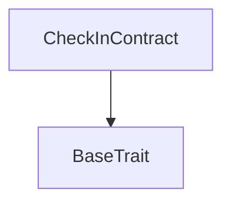
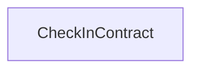

# TACT Compilation Report
Contract: CheckInContract
BOC Size: 580 bytes

# Types
Total Types: 5

## StateInit
TLB: `_ code:^cell data:^cell = StateInit`
Signature: `StateInit{code:^cell,data:^cell}`

## Context
TLB: `_ bounced:bool sender:address value:int257 raw:^slice = Context`
Signature: `Context{bounced:bool,sender:address,value:int257,raw:^slice}`

## SendParameters
TLB: `_ bounce:bool to:address value:int257 mode:int257 body:Maybe ^cell code:Maybe ^cell data:Maybe ^cell = SendParameters`
Signature: `SendParameters{bounce:bool,to:address,value:int257,mode:int257,body:Maybe ^cell,code:Maybe ^cell,data:Maybe ^cell}`

## WithdrawTon
TLB: `withdraw_ton#fabed8e6 amount:coins = WithdrawTon`
Signature: `WithdrawTon{amount:coins}`

## CheckInMessage
TLB: `check_in_message#e8ccf642 sender:address timestamp:uint64 = CheckInMessage`
Signature: `CheckInMessage{sender:address,timestamp:uint64}`

# Get Methods
Total Get Methods: 1

## msg_value
Argument: value

# Error Codes
2: Stack underflow
3: Stack overflow
4: Integer overflow
5: Integer out of expected range
6: Invalid opcode
7: Type check error
8: Cell overflow
9: Cell underflow
10: Dictionary error
13: Out of gas error
32: Method ID not found
34: Action is invalid or not supported
37: Not enough TON
38: Not enough extra-currencies
128: Null reference exception
129: Invalid serialization prefix
130: Invalid incoming message
131: Constraints error
132: Access denied
133: Contract stopped
134: Invalid argument
135: Code of a contract was not found
136: Invalid address
137: Masterchain support is not enabled for this contract
2023: Owner cannot check in
14534: Not owner
27168: Insufficient fee sent
49477: Only owner can set the reward
53920: Only owner can set the fee

# Trait Inheritance Diagram

# Contract Dependency Diagram

